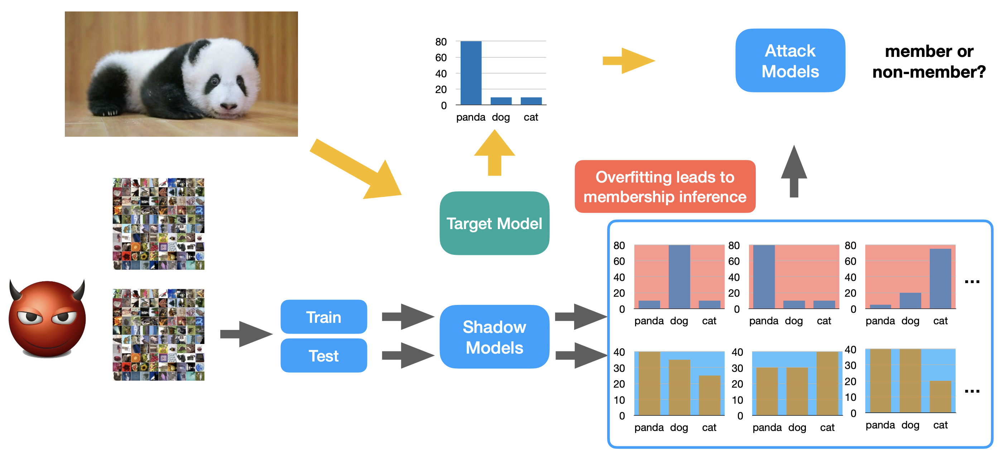

# Membership Inference Attack (MIA) Pipeline


## Overview

This repository implements a **Membership Inference Attack (MIA)** to analyze privacy leakage in machine learning models. The goal is to determine whether a specific data point was used to train a target model.

This implementation uses the **Shadow Model technique**. It simulates the behavior of the target model to create a labeled dataset, which is then used to train a binary classifier (the attack model) to distinguish between members (training data) and non-members (test data).

## Methodology

The attack follows a three-step pipeline:

1. **Shadow Modeling:** Train multiple "shadow models" that mimic the target model's architecture and data distribution.
2. **Dataset Construction:** Specific confidence vectors (prediction outputs) from the shadow models are aggregated to create a labeled attack dataset.
3. **Inference:** A binary classifier is trained on this dataset to recognize the confidence patterns of "members" vs "non-members."



## Project Structure

The project is organized into the following modules:

```text
membership_inference/
├── config.py                          # Hyperparameters & task definitions
├── pipeline.py                        # Main execution script
├── src/
│   ├── models/
│   │   └── architectures.py           # Attack model definitions (BasicNN, etc.)
│   ├── attacks/
│   │   └── mia_logic.py               # Core attack logic & metrics
│   ├── training/
│   │   ├── train_shadow_models.py     # Script: Train shadow models
│   │   ├── train_attack_models.py     # Script: Train attack classifier
│   │   └── create_attack_dataset.py   # Script: Generate attack data
│   └── utils/
│       └── submission.py              # Helper for submission files
├── saved_shadow_models/               # Shadow model checkpoints
├── saved_attack_models/               # Attack model checkpoints
├── attack_dataset/                    # Generated attack datasets
└── datasets/                          # Raw shadow data (download required)

```

### Tasks

The code supports four specific configurations:

| Task ID | Target Model | Dataset | Classes |
| --- | --- | --- | --- |
| **task0** | ResNet34 | CIFAR-10 | 10 |
| **task1** | MobileNetV2 | CIFAR-10 | 10 |
| **task2** | ResNet34 | Tiny ImageNet | 200 |
| **task3** | MobileNetV2 | Tiny ImageNet | 200 |

## Setup & Usage

### 1. Prerequisites

Install the required dependencies:

```bash
pip install torch torchvision numpy

```

### 2. Prepare Data

Create a `datasets` directory in the root folder. Download the required shadow datasets as detailed in `Instructions.md`.

### 3. Running the Code

The `pipeline.py` script handles the training and evaluation logic.

**Train and Evaluate (Eval Mode)**
To train shadow models, generate attack data, and evaluate the attack success rate:

```bash
python pipeline.py --mode eval --task task0

```

**Generate Submission (Test Mode)**
To run inference using pre-trained models:

```bash
python pipeline.py --mode test --task task0

```

## References

* Based on concepts from: Shokri et al., "Membership Inference Attacks Against Machine Learning Models" (S&P 2017).